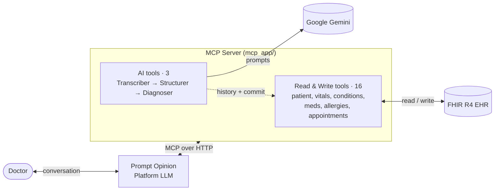

# PromptOpinion Clinical Scribe

A clinical-scribe MCP server for the Prompt Opinion platform. Structures
doctor-patient conversations into FHIR R4 resources, fetches the patient's
prior history, suggests diagnostic next steps, and writes the doctor-approved
encounter back to FHIR. Also exposes general-purpose CRUD tools for patient
demographics, conditions, medications, allergies, observations, and
appointments.

## Architecture



## Tools

| Category | Tool | Description |
| --- | --- | --- |
| **Read** | `FindPatient` | Search by first/last name |
| | `GetPatient` | Demographics by id |
| | `GetPatientHistory` | Full clinical bundle |
| | `GetActiveConditions` | Active problem list |
| | `GetMedications` | Active medications |
| | `GetAllergies` | Allergy list |
| | `GetRecentObservations` | Vitals + labs (filter by category) |
| | `GetEncounterHistory` | Past visits |
| | `GetImmunizations` | Vaccination history |
| **AI** | `StructureClinicalConversation` | Transcript → FHIR-shaped payload (Gemini) |
| | `StructureAudioConversation` | Audio URL → transcript (Gemini multimodal) → FHIR-shaped payload |
| | `SuggestDiagnosis` | Differential + next steps from history |
| **Write** | `CreatePatient` | Register a new patient |
| | `UpdatePatientDemographics` | Edit name / DOB / contacts |
| | `RecordObservation` | Add a vital or lab value |
| | `AddCondition` | Add to problem list |
| | `AddAllergy` | Record allergy / intolerance |
| | `ScheduleAppointment` | Book a future visit |
| | `CommitEncounter` | Persist approved visit as transaction Bundle |

## FHIR backend

The server reads `FHIR_BASE_URL` from `.env` for local development. The
default is the **public HAPI test server** — open, no auth, R4 compliant:

```
FHIR_BASE_URL=https://hapi.fhir.org/baseR4
```

In production, the Prompt Opinion platform overrides this on every request
via the `x-fhir-server-url` and `x-fhir-access-token` headers (SHARP-on-MCP
convention), so the same code works against any FHIR R4 server the platform
is connected to.

## Models

A single Gemini model is shared by all three AI agents, called through the
`google-genai` SDK. The structuring and diagnosis agents use Gemini's native
JSON-structured-output mode (`response_schema`); the transcription agent uses
the multimodal text path with an inline audio Part.

| Step | Agent | Mode |
| --- | --- | --- |
| Audio → transcript | `shared/agents/transcriber.py` | Multimodal (audio in, text out) |
| Transcript → FHIR-shaped JSON | `shared/agents/structurer.py` | Structured output (`StructuredEncounterPayload`) |
| Encounter + history → differential | `shared/agents/diagnoser.py` | Structured output (`DiagnosisSuggestion`) |

Default model is `gemini-2.5-flash`; override with the `GEMINI_MODEL` env var
(e.g. `gemini-2.5-pro` for higher quality, `gemini-2.5-flash-lite` for
cheaper/faster).

## Setup

```bash
python3 -m venv .venv
source .venv/bin/activate
pip install -r requirements.txt
cp .env.example .env
# fill in GOOGLE_API_KEY (https://aistudio.google.com/apikey)
```

## Run locally

```bash
uvicorn mcp_app.main:app --host 0.0.0.0 --port 8010
```

Test against HAPI public server:

```bash
python <<'PY'
import asyncio
from mcp import ClientSession
from mcp.client.streamable_http import streamablehttp_client

async def main():
    async with streamablehttp_client("http://127.0.0.1:8010/mcp") as (r, w, _):
        async with ClientSession(r, w) as s:
            await s.initialize()
            tools = await s.list_tools()
            print([t.name for t in tools.tools])
            res = await s.call_tool(
                "FindPatient",
                {"firstName": "Edward", "lastName": "Balistreri"},
            )
            print(res.content[0].text)

asyncio.run(main())
PY
```

## Publishing to Prompt Opinion

1. **Deploy** the MCP server to a public URL (Cloud Run, Fly, Render,
   Railway, or expose locally with ngrok / cloudflared / localhost.run):
   ```bash
   uvicorn mcp_app.main:app --host 0.0.0.0 --port 8010
   ```
2. **Register** on the Prompt Opinion Marketplace using the URL of your
   deployed `/mcp` endpoint, e.g. `https://your-host.example.com/mcp`.
3. The platform reads the server's capabilities on first connect and sees
   the `ai.promptopinion/fhir-context` extension declaring the SMART scopes
   the server needs. The workspace admin grants those scopes; from then on
   the platform injects `x-fhir-server-url` / `x-fhir-access-token` /
   `x-patient-id` on every tool call, overriding the local `FHIR_BASE_URL`.

## SHARP / FHIR-context contract (cheat sheet)

### Per-request HTTP headers

| Header                | Required | Purpose                                            |
| --------------------- | -------- | -------------------------------------------------- |
| `x-fhir-server-url`   | platform-provided | FHIR R4 base URL                          |
| `x-fhir-access-token` | platform-provided | Bearer token (also parsed for `patient` JWT claim) |
| `x-patient-id`        | optional | Active patient id (fallback if not in JWT)         |

In local dev these are all absent, and the server falls back to
`FHIR_BASE_URL` / `FHIR_ACCESS_TOKEN` from `.env`.

### Capability advertisement on `initialize`

```json
{
  "extensions": {
    "ai.promptopinion/fhir-context": {
      "scopes": [
        {"name": "patient/Patient.rs", "required": true},
        {"name": "patient/Encounter.rs", "required": true},
        {"name": "patient/Condition.rs", "required": true},
        {"name": "patient/Observation.rs", "required": true},
        {"name": "patient/MedicationStatement.rs"},
        {"name": "patient/MedicationRequest.rs"},
        {"name": "patient/AllergyIntolerance.rs"},
        {"name": "patient/Immunization.rs"},
        {"name": "patient/Appointment.rs"},
        {"name": "patient/Patient.cu"},
        {"name": "patient/Encounter.cu"},
        {"name": "patient/Observation.cu"},
        {"name": "patient/Condition.cu"},
        {"name": "patient/AllergyIntolerance.cu"},
        {"name": "patient/Appointment.cu"},
        {"name": "patient/ClinicalImpression.cu"}
      ]
    }
  }
}
```

## Project layout

```
.
├── mcp_app/                ★ publishable: MCP server (SHARP-on-MCP)
│   ├── main.py             streamable-http entry point
│   ├── mcp_instance.py     FastMCP + capability advertisement + tool registration
│   ├── mcp_constants.py    SHARP header / extension keys
│   ├── fhir_client.py      bearer-token httpx client (read/search/create/update/bundle)
│   ├── fhir_context.py     resolves x-fhir-* headers w/ env-var fallback
│   ├── http.py             shared httpx.AsyncClient (connection pooling)
│   ├── llm.py              Gemini client + structured_completion / text_completion
│   └── tools/              one MCP tool per file (19 total)
│
└── shared/                 cross-cutting helpers
    ├── fhir/
    │   ├── schemas.py      Pydantic StructuredEncounterPayload, DiagnosisSuggestion
    │   └── bundle.py       build_resources_from_payload (payload → FHIR R4 resources)
    └── agents/
        ├── transcriber.py  transcribe_audio (Gemini multimodal, audio → text)
        ├── structurer.py   structure_transcript (transcript → StructuredEncounterPayload)
        └── diagnoser.py    suggest_diagnosis_for_encounter (encounter + history → DiagnosisSuggestion)
```

## Reference implementations

- MCP — [prompt-opinion/po-community-mcp](https://github.com/prompt-opinion/po-community-mcp)
- SHARP-on-MCP — [sharponmcp.com](https://www.sharponmcp.com/)
- Public test FHIR server — [HAPI FHIR R4](https://hapi.fhir.org/baseR4)
